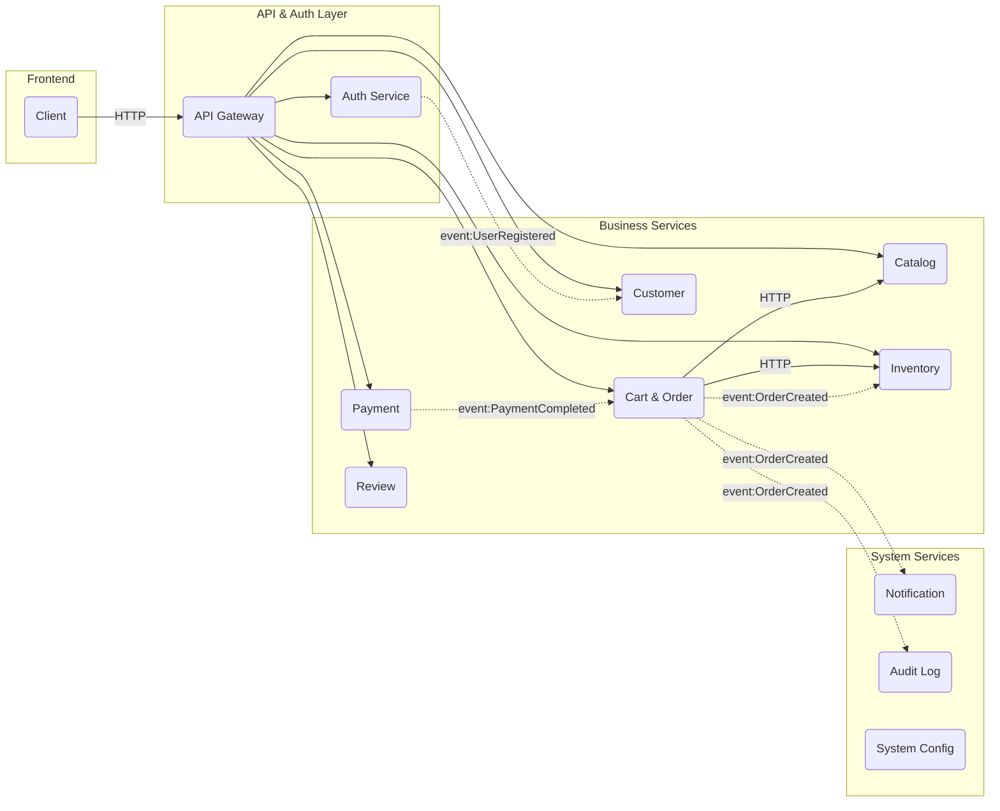

# Executive Summary  
PickleHub là một website bán lẻ đồ chơi pickleball theo kiến trúc **microservices**. Ứng dụng được chia thành các dịch vụ nhỏ (dịch vụ sản phẩm, giỏ hàng/đơn hàng, thanh toán, người dùng, thông báo,…) hoạt động độc lập, giao tiếp qua REST và message broker. Mỗi microservice tự chủ về dữ liệu và logic của mình. Hệ thống sử dụng công nghệ .NET 8, cơ sở dữ liệu PostgreSQL, RabbitMQ (MassTransit), Docker/Kubernetes, và các dịch vụ bên thứ ba (Cloudinary, SendGrid) để đảm bảo tính khả dụng, mở rộng và dễ bảo trì.  Mục tiêu cuối cùng là hoàn thiện MVP end-to-end từ xem sản phẩm đến đặt hàng/thanh toán, áp dụng pattern MediatR và DevOps (CI/CD) để có sản phẩm “production-ready”.

# Mục tiêu dự án  
- **Xây dựng website bán đồ Pickleball đầy đủ (MVP)**: gồm trang chủ, danh sách sản phẩm (vợt, bóng, giày, quần áo, phụ kiện…), chức năng giỏ hàng, đặt hàng, thanh toán (COD và PayOS), theo dõi đơn hàng.  
- **Kiến trúc microservices**: Tách các chức năng chính thành dịch vụ riêng (Catalog, Inventory, Cart&Order, Payment, Customer/User, Review, Notification, Audit, System, v.v.), áp dụng design pattern CQRS + MediatR, mỗi dịch vụ có DB riêng.  
- **Công nghệ hiện đại**: Sử dụng ASP.NET Core (.NET 8) cho các API, gRPC/REST, RabbitMQ (MassTransit) cho messaging, Docker/Kubernetes cho container hóa, GitHub Actions cho CI/CD.  
- **Tính độc lập đơn giản**: Dự án do một người phát triển nên ưu tiên thiết kế gọn nhẹ, dễ triển khai. Tuy nhiên phải đủ để minh chứng kiến thức kiến trúc phân tán (scalability, resilience, maintainability).  

# Kiến trúc tổng thể  

## Danh sách Service chính  
- **API Gateway**: trung gian tiếp nhận yêu cầu từ client, xác thực JWT, chuyển tiếp tới các service phù hợp. Có thể dùng Ocelot hoặc Azure API Management.  
- **Auth Service**: Xác thực/Đăng ký người dùng, quản lý JWT/Refresh Token, phân quyền (Admin/Customer). Lưu trữ thông tin đăng nhập.  
- **Catalog Service**: Quản lý sản phẩm, danh mục, thương hiệu. CRUD sản phẩm, trả kết quả tìm kiếm/lọc.  
- **Inventory Service**: Quản lý tồn kho. Kiểm tra và cập nhật số lượng khi có đơn hàng.  
- **Cart & Order Service**: Lưu giỏ hàng (tạm thời hoặc cơ sở dữ liệu), xử lý checkout, tạo đơn hàng. Đơn hàng lưu snapshot thông tin sản phẩm tại thời điểm đặt (tên, giá) và trạng thái. Publish event `OrderCreated`.  
- **Payment Service**: Xử lý thanh toán (COD, PayOS). Tạo record thanh toán, nhận webhook từ PayOS, publish event `PaymentCompleted`.  
- **Customer Service**: Quản lý hồ sơ khách hàng (profile) và địa chỉ. Cho phép xem/cập nhật thông tin cá nhân và quản lý nhiều địa chỉ (có default).  
- **Review Service**: Cho phép user đánh giá, bình luận sản phẩm (điểm sao, nội dung). Mỗi review lưu UserId, ProductId, rating, comment.  
- **Notification Service**: Xử lý thông báo. Subscribe các sự kiện (OrderCreated, PaymentCompleted, v.v.) để gửi email qua SendGrid và ghi web notifications (in-app bell).  
- **Audit Log Service**: Ghi lại nhật ký hoạt động quan trọng (hành động của user/admin). Subscribe các event quan trọng (tạo đơn, cập nhật đơn, block user, v.v.) để lưu log.  
- **System Service**: Quản lý cấu hình chung (giá ship mặc định, banner thông báo, thông số hệ thống...).  

Ngoài ra có **Common/Utils** (thư viện chung) chứa các class, extension, helper dùng chung giữa các service (logging, extension methods, v.v.), **không** lưu state. Theo nguyên tắc *database-per-service*, mỗi service có database riêng (PostgreSQL). Điều này đảm bảo các service phụ thuộc lỏng lẻo và dễ phát triển độc lập.  

## Sơ đồ kiến trúc (khái quát)  
```
Client → Gateway (JWT auth) → {Catalog, Inventory, CartOrder, Payment, Customer, Review}
                                                           ↓
                                                  (RabbitMQ Events)
                                            OrderCreated → {Inventory, Notification, Audit}
                                    PaymentCompleted → CartOrder
                                    UserRegistered → Customer
```  
Mô hình **Container**: Các service chạy độc lập trong container, Frontend (SPA hoặc MVC) gọi qua Gateway. Dữ liệu mỗi service riêng (PostgreSQL). Messaging dùng RabbitMQ (MassTransit) để publish/subscribe.

# Lộ trình phát triển (Roadmap theo Phase)  

Dưới đây là các giai đoạn chính (phase) và các công việc (task) chi tiết:

### Phase 0 – Cơ sở hạ tầng & authentication  
- **Dev tasks**: Tạo Solution, Project API Gateway (ví dụ sử dụng Ocelot), Auth Service, thư viện Common/Utils. Cấu hình ASP.NET Core Web API. Xây dựng Authen Service với Entity User (Id, Email, PasswordHash, Role) và REST API đăng ký/đăng nhập. Dùng BCrypt để hash mật khẩu. Cấu hình JWT token (`AddJwtBearer`) để trả về AccessToken và RefreshToken.  
- **Infra tasks**: Thiết lập cơ sở dữ liệu PostgreSQL (DB cho Auth). Dockerize các service cơ bản (Dockerfile). Bước đầu cấu hình Docker Compose (Auth, DB, RabbitMQ).  
- **Testing tasks**: Viết unit test cho Auth (hash password, validate credentials). Kiểm thử đăng ký/đăng nhập trả token.  
- **Docs**: Tài liệu API Auth (endpoint, request/response JSON). Hướng dẫn cài đặt .env cho connection strings và secrets.  
- **Thời gian ước lượng**: Không xác định (tùy kinh nghiệm, có thể ~1-2 tuần).  

### Phase 1 – Catalog & Inventory (Sản phẩm và kho)  
- **Dev tasks**: Tạo Catalog Service với các entity: Category, Brand, Product (Product gồm Id, Name, Description, Price, Specs, CategoryId, BrandId, ImageUrl, v.v.). Viết CRUD API cho Category, Brand, Product (GET list, GET detail, POST, PUT, DELETE). Tạo Inventory Service với entity InventoryItem (ProductId PK, Quantity). Thêm API kiểm tra tồn kho (GET `/inventory/{productId}`) và cập nhật (Admin).  
- **Infra tasks**: DB Catalog (bảng categories, brands, products) và DB Inventory. Docker Compose mở rộng gồm container cho 2 DB này. Kết nối RabbitMQ (sẽ dùng ở phase sau, nhưng có thể setup now).  
- **Testing tasks**: Unit test cho handlers/validation (ví dụ: khi add sản phẩm kiểm tra dữ liệu). Integration test dịch vụ Catalog, Inventory (dùng TestServer). Thử tạo nhiều sản phẩm, thực hiện lọc/tìm kiếm.  
- **Docs**: Spec API (Catalog: `/api/catalog/products`, `/api/catalog/categories`; Inventory: `/api/inventory/{productId}`). Hướng dẫn seed dữ liệu mẫu vào DB.  
- **Thời gian**: Không xác định.  

### Phase 2 – Cart & Order (Giỏ hàng và đặt hàng)  
- **Dev tasks**: Tạo Cart/Order Service. Entity: Cart (CartId, UserId) và CartItem (CartId, ProductId, Qty). API quản lý giỏ hàng (GET thêm/xóa). Checkout: Endpoint POST `/api/orders` nhận request bao gồm giỏ hàng và thông tin giao hàng (ShippingAddress). Tạo Entity Order (OrderId, UserId, TotalPrice, Status, ShippingAddress JSON), OrderItem (OrderId, ProductId, PriceSnapshot, Quantity). Xử lý tạo đơn: - Lấy giá & kiểm tồn kho (gọi sync tới Catalog, Inventory) - Tính tổng, lưu đơn với status “Pending”. - Publish event **OrderCreated** (đơn được tạo).  
- **Infra tasks**: DB Order (orders, order_items). Cấu hình MassTransit/RabbitMQ publish event `OrderCreated`. Cài Exchange/Queue: Ví dụ exchange “OrderCreated” với fanout binding đến Inventory, Notification, Audit.  
- **Testing tasks**: Unit test ValidateCommand (kiểm tồn, tính giá). Integration test một luồng từ Checkout API đến DB Order (dùng WebApplicationFactory). Mô phỏng Inventory trả đúng/thiếu.  
- **Docs**: Spec API Order: Ví dụ POST `/api/orders` (JSON { items: [{productId, qty}], shipping:{name, address,…}}). API GET đơn theo user. Mô tả các status (Pending, Confirmed, Shipping, Completed, Cancelled).  
- **Thời gian**: Không xác định.  

### Phase 3 – Payment  
- **Dev tasks**: Tạo Payment Service. Entity: Payment (PaymentId, OrderId, Amount, Method, Status, CreatedAt). API tạo thanh toán (POST `/api/payments`) cho hình thức COD hoặc PayOS (nếu PayOS trả về URL thanh toán). Xử lý webhook từ PayOS khi thanh toán thành công/thất bại: update Payment, publish event **PaymentCompleted** hoặc **PaymentFailed**. Trong event truyền orderId và kết quả. Order Service sẽ subscribe event PaymentCompleted để cập nhật status order sang “Confirmed” (hoặc hủy nếu thất bại).  
- **Infra tasks**: DB Payment (payments). Cài đặt MassTransit tiếp event PaymentCompleted. (Không cần RabbitMQ khác vì dùng chung).  
- **Testing tasks**: Unit test xử lý webhook (nhận JSON từ PayOS giả lập). Integration test calling API tạo payment.  
- **Docs**: Quy trình thanh toán (ví dụ POST /payments, callback endpoint). Ghi chú mã trạng thái trả về.  
- **Thời gian**: Không xác định.  

### Phase 4 – Customer & Review  
- **Dev tasks**: Customer Service: Entity CustomerProfile (Id = UserId từ Auth, Email, FullName, Phone, IsBlocked), Address (AddressId, CustomerId, Name, Phone, AddressLine, City, IsDefault). API: GET/PUT profile (user tự xem/cập nhật tên, điện thoại), CRUD địa chỉ (POST, PUT, DELETE, GET danh sách). Admin API: block/unblock user (set IsBlocked).  
  Review Service: Entity Review (Id, ProductId, UserId, Rating, Comment, CreatedAt). API: POST /products/{id}/reviews (tạo review cho sản phẩm), GET /products/{id}/reviews (list).  
- **Infra tasks**: DB Customer (customers, addresses), DB Review (reviews). (CustomerService có thể subscribe sự kiện `UserRegistered` để tạo sẵn CustomerProfile khi có user mới). RabbitMQ config: exchange `UserRegistered` kết nối CustomerService.  
- **Testing tasks**: Unit test validation (ví dụ rating 1-5). Integration test CRUD address. Test tạo review và xem danh sách.  
- **Docs**: Spec API Customer (GET/PUT `/api/customers/me`, Địa chỉ `/api/addresses`). Review: POST/GET reviews.  
- **Thời gian**: Không xác định.  

### Phase 5 – Notification & Audit Log  
- **Dev tasks**: Notification Service: subscribe các sự kiện (OrderCreated, PaymentCompleted, OrderCancelled,…). Khi OrderCreated: gửi email xác nhận đơn qua SendGrid (Sử dụng SendGrid .NET SDK) và tạo record web notification (Notification entity: Id, UserId, Message, IsRead, CreatedAt). Khi PaymentCompleted: gửi email báo thành công. Audit Log: subscribe hầu hết event quan trọng (OrderCreated, PaymentCompleted, UserRegistered, BlockUser, v.v.) và lưu vào bảng AuditLog (UserId, Action, Data, Timestamp).  
- **Infra tasks**: DB Notification (notifications), DB Audit (audit_logs). Cấu hình SMTP/SendGrid API Key trong config, RabbitMQ bindings cho các event. (Ví dụ exchange OrderCreated bind queue Notification và Audit).  
- **Testing tasks**: Kiểm thử gửi email (có thể dùng sandbox mode SendGrid hoặc mock). Test lưu notification và audit log.  
- **Docs**: Quy trình notification (khi nào gửi email, nội dung template). Định nghĩa các loại audit entry.  
- **Thời gian**: Không xác định.  

### Phase 6 – System Configuration & Admin Portal  
- **Dev tasks**: System Service: Entity Config (Key, Value) và Banner (Id, ImageUrl, Link). API cho admin quản lý cấu hình (GET/PUT cấu hình như phí ship, alert threshold) và banner (CRUD). Admin Portal: UI tách biệt (không thuộc backend) để điều khiển các service (có thể skip trong MVP nếu tập trung vào backend).  
- **Infra tasks**: DB System (configs, banners). Tất cả config được tải từ DB.  
- **Testing tasks**: Test lưu đọc cấu hình, banner hiển thị.  
- **Docs**: API Config (ví dụ GET/PUT `/api/system/config/{key}`).  
- **Thời gian**: Không xác định.  

# Phụ thuộc giữa các Service  

| Service          | Gọi sync qua API tới          | Publish Event         | Subscribe Event         |
|------------------|-------------------------------|-----------------------|-------------------------|
| **API Gateway**  | –                             | –                     | –                       |
| **Authen**       | –                             | `UserRegistered`      | –                       |
| **Catalog**      | –                             | –                     | –                       |
| **Inventory**    | –                             | –                     | `OrderCreated`          |
| **Cart & Order** | Catalog, Inventory            | `OrderCreated`, `OrderCancelled` | `PaymentCompleted` |
| **Payment**      | –                             | `PaymentCompleted`    | –                       |
| **Customer**     | –                             | –                     | `UserRegistered`        |
| **Review**       | Catalog                       | –                     | –                       |
| **Notification** | –                             | –                     | `OrderCreated`, `PaymentCompleted` |
| **Audit Log**    | –                             | –                     | `OrderCreated`, `PaymentCompleted`, `UserRegistered`, … |
| **System**       | –                             | –                     | –                       |



# Mô hình cơ sở dữ liệu mẫu  
Dưới đây là ví dụ schema (PostgreSQL) cho một số service chính. Bạn có thể mở rộng/cập nhật tuỳ theo chi tiết:

### Authen Service (Users)  
```sql
CREATE TABLE users (
    id UUID PRIMARY KEY,
    email TEXT NOT NULL UNIQUE,
    password_hash TEXT NOT NULL,
    role TEXT NOT NULL,        -- "Admin" hoặc "Customer"
    refresh_token TEXT,
    token_expiry TIMESTAMPTZ
);
```

### Catalog Service (Products)  
```sql
CREATE TABLE categories (
    id UUID PRIMARY KEY,
    name TEXT NOT NULL
);
CREATE TABLE brands (
    id UUID PRIMARY KEY,
    name TEXT NOT NULL
);
CREATE TABLE products (
    id UUID PRIMARY KEY,
    name TEXT NOT NULL,
    description TEXT,
    price DECIMAL NOT NULL,
    specs JSONB,             -- thông số kỹ thuật
    category_id UUID REFERENCES categories(id),
    brand_id UUID REFERENCES brands(id),
    image_url TEXT
);
```

### Inventory Service  
```sql
CREATE TABLE inventory_items (
    product_id UUID PRIMARY KEY,
    quantity INT NOT NULL
);
```

### Cart & Order Service  
```sql
CREATE TABLE orders (
    id UUID PRIMARY KEY,
    user_id UUID NOT NULL,
    total_price DECIMAL NOT NULL,
    status TEXT NOT NULL,
    shipping_fullname TEXT,
    shipping_phone TEXT,
    shipping_address TEXT,
    shipping_city TEXT,
    created_at TIMESTAMPTZ DEFAULT NOW()
);
CREATE TABLE order_items (
    id UUID PRIMARY KEY,
    order_id UUID REFERENCES orders(id),
    product_id UUID NOT NULL,
    product_name TEXT NOT NULL,    -- snapshot
    unit_price DECIMAL NOT NULL,   -- snapshot price
    quantity INT NOT NULL
);
```

### Payment Service  
```sql
CREATE TABLE payments (
    id UUID PRIMARY KEY,
    order_id UUID REFERENCES orders(id),
    amount DECIMAL NOT NULL,
    method TEXT NOT NULL,      -- "COD" hoặc "PayOS"
    status TEXT NOT NULL,      -- e.g. "Pending", "Completed", "Failed"
    created_at TIMESTAMPTZ DEFAULT NOW()
);
```

### Customer Service  
```sql
CREATE TABLE customers (
    id UUID PRIMARY KEY,        -- trùng UserId từ Authen
    email TEXT NOT NULL,
    full_name TEXT,
    phone TEXT,
    is_blocked BOOLEAN DEFAULT FALSE
);
CREATE TABLE addresses (
    id UUID PRIMARY KEY,
    customer_id UUID REFERENCES customers(id),
    fullname TEXT,
    phone TEXT,
    address_line TEXT,
    city TEXT,
    is_default BOOLEAN DEFAULT FALSE
);
```

### Review Service  
```sql
CREATE TABLE reviews (
    id UUID PRIMARY KEY,
    product_id UUID NOT NULL,
    user_id UUID NOT NULL,
    rating INT NOT NULL CHECK (rating >= 1 AND rating <= 5),
    comment TEXT,
    created_at TIMESTAMPTZ DEFAULT NOW()
);
```

### Notification Service  
```sql
CREATE TABLE notifications (
    id UUID PRIMARY KEY,
    user_id UUID NOT NULL,
    message TEXT NOT NULL,
    is_read BOOLEAN DEFAULT FALSE,
    created_at TIMESTAMPTZ DEFAULT NOW()
);
```

### Audit Log Service  
```sql
CREATE TABLE audit_logs (
    id UUID PRIMARY KEY,
    user_id UUID,
    action TEXT,
    data JSONB,
    created_at TIMESTAMPTZ DEFAULT NOW()
);
```

### System Service  
```sql
CREATE TABLE system_configs (
    config_key TEXT PRIMARY KEY,
    config_value TEXT NOT NULL
);
CREATE TABLE banners (
    id UUID PRIMARY KEY,
    image_url TEXT,
    link TEXT
);
```

# API Contract mẫu  

Các API chính có thể thiết kế như sau (REST/HTTP JSON):

- **POST /api/auth/register** – Đăng ký user. Request JSON:  
  ```json
  { "email": "user@example.com", "password": "P@ssw0rd!" }
  ```  
  Response 201:  
  ```json
  { "userId": "guid", "email": "user@example.com", "role": "Customer" }
  ```

- **POST /api/auth/login** – Đăng nhập. Request:  
  ```json
  { "email": "user@example.com", "password": "P@ssw0rd!" }
  ```  
  Response 200:  
  ```json
  { 
    "accessToken": "eyJhbGci...", 
    "refreshToken": "abc123...", 
    "expiresIn": 3600 
  }
  ```

- **GET /api/catalog/products** – Lấy danh sách sản phẩm (có thể phân trang, lọc).  
  Response 200:  
  ```json
  [
    { "id": "...", "name": "Vợt A", "price": 123000, "brand": "BrandX", "category": "Vợt" },
    { ... }
  ]
  ```

- **GET /api/products/{id}** – Lấy chi tiết sản phẩm.  
  Response 200:  
  ```json
  { "id": "...", "name": "Vợt A", "description": "...", "price": 123000, "brand": "BrandX", "category": "Vợt" }
  ```

- **POST /api/cart/items** – Thêm vào giỏ hàng. Header có JWT. Request:  
  ```json
  { "productId": "...", "quantity": 2 }
  ```

- **GET /api/cart** – Xem giỏ hàng (theo UserId từ JWT). Response:  
  ```json
  { "userId": "...", "items": [ { "productId":"...", "quantity":2, "unitPrice":123000 } ], "total": 246000 }
  ```

- **POST /api/orders** – Đặt hàng (checkout). Header JWT. Request:  
  ```json
  {
    "items": [ { "productId": "...", "quantity": 2 } ],
    "shipping": {
      "fullname": "Nguyen Van A",
      "phone": "0123456789",
      "address": "123 Phố X",
      "city": "Hà Nội"
    }
  }
  ```  
  Response 201:  
  ```json
  { "orderId": "...", "status": "Pending" }
  ```

- **GET /api/orders/{orderId}** – Xem chi tiết đơn hàng của user.

- **POST /api/payments** – Tạo thanh toán cho đơn hàng. Request:  
  ```json
  { "orderId": "...", "method": "COD" }
  ```  
  Response 200:  
  ```json
  { "paymentId": "...", "status": "Pending", "amount": 246000 }
  ```

- **POST /api/payments/webhook/payos** – Webhook PayOS (không cần body; dữ liệu lấy từ query string hoặc header PayOS). Payment Service xử lý cập nhật.

- **GET/PUT /api/customers/me** – Xem/Cập nhật profile (JWT). PUT Request:  
  ```json
  { "fullName": "Nguyen Van A", "phone": "0123456789" }
  ```

- **GET/POST/PUT/DELETE /api/addresses** – CRUD địa chỉ (body giống shipping trong Order).  

- **POST /api/products/{id}/reviews** – Tạo đánh giá cho sản phẩm. Request:  
  ```json
  { "rating": 5, "comment": "Sản phẩm tốt!" }
  ```  
  Response 201: `{ "reviewId": "guid", "createdAt": "2026-07-06T..." }`.

Đối với mỗi endpoint, thiết kế rõ ràng schema request/response và mã lỗi (400, 401, 404…). Sử dụng Swagger/OpenAPI để mô tả API cho frontend và tester.

# Danh sách sự kiện & Message Schema  

Các **Integration Events** chính dùng RabbitMQ/MassTransit:  

- **UserRegistered**: Phát khi user mới đăng ký.  
  ```json
  {
    "userId": "guid",
    "email": "user@example.com"
  }
  ```  

- **OrderCreated**: Phát khi đơn hàng mới được tạo.  
  ```json
  {
    "orderId": "guid",
    "userId": "guid",
    "items": [
      { "productId": "guid", "productName": "Vợt A", "unitPrice": 123000, "quantity": 2 }
    ],
    "totalPrice": 246000,
    "createdAt": "2026-07-06T12:34:56Z"
  }
  ```  

- **PaymentCompleted**: Phát khi thanh toán hoàn tất (thành công).  
  ```json
  {
    "paymentId": "guid",
    "orderId": "guid",
    "amount": 246000,
    "status": "Completed",
    "completedAt": "2026-07-06T12:40:00Z"
  }
  ```  

- **OrderCancelled** (nếu có hủy đơn):  
  ```json
  {
    "orderId": "guid",
    "reason": "User cancelled",
    "cancelledAt": "2026-07-06T12:50:00Z"
  }
  ```  

- **Các sự kiện khác** (tùy nhu cầu mở rộng): *InventoryLow*, *ReviewCreated*, v.v.  

Mỗi sự kiện là một message được publish lên RabbitMQ theo kiểu *publish/subscribe*. Dịch vụ liên quan sẽ subscribe và xử lý, đảm bảo **event-driven**. Ví dụ, Inventory Service subscribe `OrderCreated` để trừ kho, Notification subscribe để gửi email, Audit Log subscribe để ghi log.  

# CI/CD và Triển khai  

- **Docker & Docker Compose**: Mỗi service đóng gói thành Docker image. Dockerfile mẫu (ASP.NET Core) có thể dùng base image chính thức:  
  ```dockerfile
  FROM mcr.microsoft.com/dotnet/aspnet:8.0 AS base
  WORKDIR /app
  EXPOSE 80
  COPY ./publish ./
  ENTRYPOINT ["dotnet", "Service.dll"]
  ```  
  (Build image bằng lệnh `docker build`, dùng `dotnet publish` để biên dịch trước). Docker Compose cho phép chạy toàn bộ stack (Postgres, RabbitMQ, tất cả service, v.v.) trong môi trường dev/testing.

- **Kubernetes**: Cho production, có thể deploy lên Kubernetes (AKS, EKS) hoặc Azure Container Apps. Chuẩn bị manifest/Helm charts cho mỗi service, config secrets (JWT keys, DB credentials, API keys).

- **CI/CD (GitHub Actions)**: Xây pipeline tự động:  
  - Bước **Build**: Checkout code, `dotnet build` & `dotnet test` cho tất cả project.  
  - Bước **Publish Docker Images**: Sau khi build, `dotnet publish` và `docker build` mỗi service, push image lên DockerHub hoặc GitHub Container Registry.  
  - Bước **Deploy**: Trigger triển khai trên staging/prod. Ví dụ chạy `docker-compose up` trên server, hoặc kubectl apply manifests (nếu xài K8s). Sử dụng secrets/GitHub Environments để lưu tokens.  
  - Tham khảo [Microsoft Docs GitHub Actions](https://learn.microsoft.com/en-us/dotnet/devops/create-dotnet-github-action) để triển khai các workflow .NET.  

- **Hosting Options**: Có thể triển khai trên cloud (Azure, AWS) hoặc on-premises. Ví dụ: Azure AKS, Azure App Service (cho từng microservice), AWS ECS/EKS, hoặc DigitalOcean. Lưu ý cấu hình Load Balancer cho API Gateway, thiết lập monitoring/alerts (Xem phần Monitoring bên dưới).

# Bảo mật & Xác thực  

- **JWT & API Gateway**: Sử dụng JSON Web Tokens cho authentication. Khi user login, Auth Service trả Access Token (JWT) chứa UserId, Role. API Gateway (ví dụ Ocelot) sẽ validate JWT trên mỗi request và inject thông tin user (qua header như `X-User-Id`, `X-User-Role`) trước khi chuyển tiếp. Mỗi service backend đọc header này mà biết user tương ứng.  
- **Phân quyền (Roles)**: Định nghĩa ít nhất hai vai trò: *Admin* và *Customer*. Endpoints admin (quản lý sản phẩm, kho, user) chỉ cho phép `Admin`. Endpoints user (checkout, review, profile) cho phép `Customer`. ASP.NET Core áp dụng `[Authorize(Roles="Admin")]` cho controller hoặc policy theo role.  
- **Cấu hình HTTPS**: Tất cả service đều dùng HTTPS để bảo mật truyền tin. Dùng certificate/TLS.  
- **Xác thực JWT**: Tuân thủ khuyến nghị: kiểm tra đầy đủ `signature`, `issuer`, `audience`, `expiration` của JWT. Nếu token không hợp lệ, trả 401.  
- **Bảo vệ API Gateway**: Gateway chỉ cho phép chuyển đến microservice nếu token hợp lệ (không cho phép bypass). Các microservice nội bộ chỉ chấp nhận yêu cầu từ Gateway (có thể check mạng/VPC hoặc thêm gateway secret).  
- **OAuth2/OIDC (tùy chọn)**: Mặc dù MVP có thể tự lưu JWT, nhưng nên xem xét dùng OpenID Connect (Auth0, Azure AD) cho production. Tuy nhiên với scope MVP, giải pháp custom + JWT phù hợp.

# Chiến lược kiểm thử  

- **Unit Tests**: Viết test cho các thành phần nhỏ (Service, Handler, Repository). Ví dụ: test các MediatR Command/Query handler độc lập bằng mock repository. Microsoft khuyến cáo: viết unit test cho core logic trước khi test tích hợp.

- **Integration Tests**: Dùng `Microsoft.AspNetCore.Mvc.Testing` để khởi tạo TestServer cho từng service. Ví dụ: Startup service trong memory, test các endpoint REST (GET/POST). Test các flow quan trọng có DB và messaging. Chia dự án test riêng biệt cho unit và integration.  

- **End-to-End (E2E)**: Kiểm thử từ phía client. Dùng Postman/Newman hoặc Playwright để test toàn bộ workflow: đăng ký/login, lấy product, thêm giỏ, đặt hàng, thanh toán, xem email (có thể dùng test inbox), kiểm tra database cuối. Các test này simulating "khách hàng thực".

- **Test Cases mẫu**:  
  - *Test đồng bộ*: Thêm/xoá sản phẩm Catalog, kiểm tra inventory thay đổi đúng.  
  - *Test luồng*: Đặt hàng thành công (hết tồn kho -> thất bại). Thanh toán thành công đổi trạng thái.  
  - *Test security*: Đăng nhập bằng user thường không thể gọi API admin (phải trả 403). Token hết hạn yêu cầu login lại.

# Giám sát & Logging  

- **Logging**: Mỗi service nên log định dạng JSON (hoặc tương tự) cho các hành động quan trọng (đơn mới, thanh toán, lỗi). Sử dụng thư viện logging như Serilog, Elastic Common Schema để dễ chuyển sang ELK. Ghi logs vào stdout để Docker/Kubernetes thu thập. Audit Log Service ghi riêng các hành động đặc biệt (Action user/admin).

- **Monitoring**: Triển khai hệ thống giám sát để theo dõi sức khoẻ services. Ví dụ: Prometheus để thu thập metric từ ứng dụng (.NET có [dotnet_exporter]), Grafana để dashboard. Cấu hình alert (Slack/Email) khi CPU/disk tăng, message queue backlog cao, hoặc số lỗi 5xx tăng đột biến.

- **Tracing (tuỳ chọn)**: Để theo dõi truy vết cross-service, có thể tích hợp OpenTelemetry. Ghi trace (distributed tracing) để debug luồng nghiệp vụ (đặt hàng, thanh toán).

# Checklist hoàn thiện & Deliverables  

- [x] Service **Authen**: đăng ký, đăng nhập, JWT, unit tests.  
- [x] **API Gateway**: định tuyến, validate JWT, inject userId.  
- [x] Service **Catalog**: CRUD sản phẩm/danh mục, tìm kiếm.  
- [x] Service **Inventory**: quản lý kho, kiểm tra tồn.  
- [x] Service **Cart & Order**: giỏ hàng, checkout, lưu đơn, xử lý trạng thái, xử lý sync gọi Catalog/Inventory.  
- [x] Service **Payment**: tạo thanh toán, xử lý webhook, publish event.  
- [x] Service **Customer**: profile, địa chỉ, quản lý user (block/unblock).  
- [x] Service **Review**: CRUD đánh giá.  
- [x] Service **Notification**: gửi email (SendGrid), web notification.  
- [x] Service **Audit Log**: ghi log hành động.  
- [x] Service **System**: config chung (phi ship, banner).  
- [x] **Database**: Thiết kế schema, EF Core migrations cho mỗi service.  
- [x] **Container**: Dockerfile cho từng service, Compose file chạy toàn bộ dev stack.  
- [x] **CI/CD**: GitHub Actions pipeline, publish Docker image, deploy script.  
- [x] **Security**: JWT cấu hình đầy đủ, role-based auth, HTTPS.  
- [x] **Testing**: Unit tests, integration tests, E2E tests case.  
- [x] **Documentation**: Swagger/OpenAPI cho các service, README hướng dẫn cài đặt, tài liệu endpoints.  

**Deliverables**: Một file `PICKLEHUB_GUIDE.md` (đầy đủ như trên), mã nguồn cấu trúc microservices (Clean Architecture), Docker Compose / Kubernetes manifests, config GitHub Actions, và hộp thư email test (nếu dùng SendGrid sandbox).

# Tài liệu tham khảo  

- Microsoft – *.NET Microservices Architecture for Containerized .NET Applications*  
- Microsoft Docs – *Asynchronous message-based communication* (RabbitMQ/Event Bus)  
- Microsoft Docs – *Clean Architecture* (Dependency Inversion, Onion)  
- Microsoft Docs – *Integration tests in ASP.NET Core*  
- Microsoft Docs – *Containerize a .NET app* (Docker guide)  
- Cloudinary – *Upload API Reference*  
- SendGrid/Twilio – *C# Email API Quickstart*  
- MassTransit – *RabbitMQ Configuration* (hướng dẫn cấu hình RabbitMQ)  
- Microsoft Docs – *Configure JWT Bearer Authentication in ASP.NET Core*  

